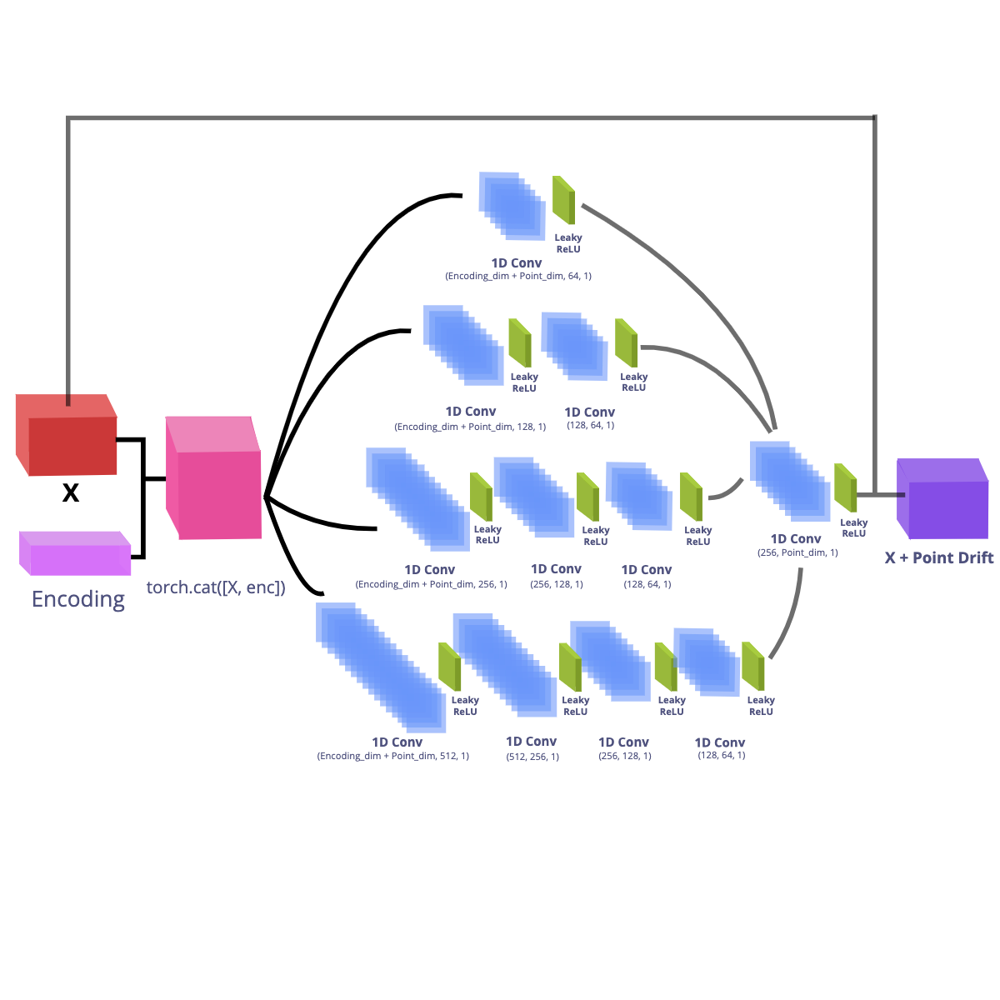

# Ensemble AutoDecoder CompNets for 3D Point Cloud Pair Encoding and Classification


## Data

For training and testing our model, we use the PointNet and the ModelNet data.

<div align='center'>

  **[PointNet7](https://stanford.edu/~rqi/pointnet/)**

  
</div>

<br>
<br>

| <div align='center'>[ModelNet10](https://3dshapenets.cs.princeton.edu/) | [ModelNet40](https://3dshapenets.cs.princeton.edu/)</div> |
| :---------------------------------------------------------------------: | :-------------------------------------------------------: |
|                                                |                                  |

</div>

### Downloading the Dataset

Data can be acquired from the [PointNet](https://stanford.edu/~rqi/pointnet/) and [ModelNet](https://3dshapenets.cs.princeton.edu/)  websites.

## Preprocessing Data

Data is converted as 3D numpy arrays and converted into 3D Tensors.

## Neural Network

### AutoDecoder Net


### Comparison Net (CompNet)

<div align='center'>
  
</div>

### Objective function

We minimize the symmetric chamfer loss between point cloud pairs of the same class and different class to get the representative latent encoding transformation vector.


### Hyper Parameters used

AutoDecoder Training

    -   Epochs: 4
    -   Learning Rate: 0.001
    -   Batch Size: 32
    -   Latent Encoding space size: 256
    -   ADAM Optimizer

CompNet Training

    -   Epochs: 20
    -   Learning Rate: 0.001
    -   Batch Size: 16
    -   Latent Encoding space size: 256  
    -   ADAM Optimizer

## Results of Similarity Classification Scores on the Test set

## Base Neural Network

For the base AutoDecoder and CompNet we get the following results:

After 157 batches and 2507 test points

    Total Accuracy: 0.883

Metrics for the same class:

    Avg loss:  0.3021
    Precision: 0.8832
    Recall:    0.8839
    F1 Score:  0.8835

Metrics for the diff class:

    Avg loss:  0.3115
    Precision: 0.8838
    Recall:    0.8831
    F1 Score:  0.8834

## Ensemble Neural Network

### Ensemble CompNet 1

Uses 5 similar CompNets that were initialized with different weights to make them independent.

<div align='center'>
  
</div>

The AutoDecoder Ensemble Net is able to perform significantly better than the single shallow layered CompNet

After 157 batches and 2507 test points

    Total Accuracy: 0.9754

Metrics for the same class:

    Avg loss:  0.0911
    Precision: 0.9707
    Recall:    0.9804
    F1 Score:  0.9755

Metrics for the diff class:

    Avg loss:  0.1923
    Precision: 0.9802
    Recall:    0.9704
    F1 Score:  0.9753

### Ensemble CompNet 2

Uses Four CompNets of different sizes to capture the general and deeper level features


After 157 batches and 2507 test points

      Total Accuracy: 0.9615

Metrics for the same class:

      Avg loss:  0.2181
      Precision: 0.9792
      Recall:    0.9429
      F1 Score:  0.9607

Metrics for the diff class:

      Avg loss:  0.1012
      Precision: 0.9450
      Recall:    0.9800
      F1 Score:  0.9622

### Ensemble AutoDecoder

Uses Four CompNets of different sizes to capture the general and deeper level features



After 157 batches and 2507 test points

      Total Accuracy: 0.9615

Metrics for the same class:

      Avg loss:  0.2181
      Precision: 0.9792
      Recall:    0.9429
      F1 Score:  0.9607

Metrics for the diff class:

      Avg loss:  0.1012
      Precision: 0.9450
      Recall:    0.9800
      F1 Score:  0.9622

## Running the Autodecoder Ensemble

### Set up Virtual Environment

Note: `Anaconda` can also be used for the venv

```shell
$ python -m venv venv
$ source venv/bin/activate
$ pip install -r requirements.txt
```

To start a new Jupyter Notebook kernel based on the current virtual environment and run a new Jupyter Notebook Instance:

```shell
$ python -m ipykernel install --user --name ENV_NAME --display-name "ENV_DISPLAY_NAME"
$ jupyter notebook
```

All information to run the ensemble neural network can be found in the `autodecoder_ensemble_net`.

The `geotnf` package and `LoaderFish.py` files are based on implementations from PR-Net `(Wang et al. 2019)`

## References

-   Non-Rigid Point Set Registration Networks, Lingjing Wang, Jianchun Chen, Xiang Li, and Yi Fang, <https://arxiv.org/pdf/1904.01428.pdf>

-   X. Chenhao, "EPDNet: Encoder-less 3D Shape Descriptor Extraction", 2020, NYUAD Capstone Seminar

-   Z. Wu, S. Song, A. Khosla, F. Yu, L. Zhang, X. Tang and J. Xiao
    3D ShapeNets: A Deep Representation for Volumetric Shapes
    Proceedings of 28th IEEE Conference on Computer Vision and Pattern Recognition (CVPR2015). <https://3dshapenets.cs.princeton.edu/paper.pdf>


-   Park, Jeong Joon et al. “DeepSDF: Learning Continuous Signed Distance Functions for Shape Representation.” 2019 IEEE/CVF Conference on Computer Vision and Pattern Recognition (CVPR) (2019): 165-174.

-   Bojanowski, Piotr et al. “Optimizing the Latent Space of Generative Networks.” ICML (2018).

-   Wang, Lingjing et al. “Non-Rigid Point Set Registration Networks.” ArXiv abs/1904.01428 (2019): n. Pag.

-   Qi, Charles Ruizhongtai et al. “PointNet: Deep Learning on Point Sets for 3D Classification and Segmentation.” 2017 IEEE Conference on Computer Vision and Pattern Recognition (CVPR) (2017): 77-85.

-   Rostami, R., Bashiri, F.S., Rostami, B. and Yu, Z. (2019), A Survey on Data‐Driven 3D Shape Descriptors. Computer Graphics Forum, 38: 356-393. doi:10.1111/cgf.13536

-   E. TaSci and A. Ugur, "Image classification using ensemble algorithms with deep learning and hand-crafted features," 2018 26th Signal Processing and Communications Applications Conference (SIU), Izmir, 2018, pp. 1-4, doi: 10.1109/SIU.2018.8404179.

-   Wolpert, David H. “Stacked Generalization.” Neural Networks 5, no. 2 (January 1992): 241–59. <https://doi.org/10.1016/S0893-6080(05)80023-1>.

-   Xie, Jingjing et al. “Horizontal and Vertical Ensemble with Deep Representation for Classification.” ArXiv abs/1306.2759 (2013): n. pag.

-   Nahas, Mohammed & Hussein, Mahmoud & Keshk, Arabi. (2019). Artificial Neural Network as Ensemble Technique Fuser for Improving Classification Accuracy. 174-179. 10.1109/ICICIS46948.2019.9014791.
