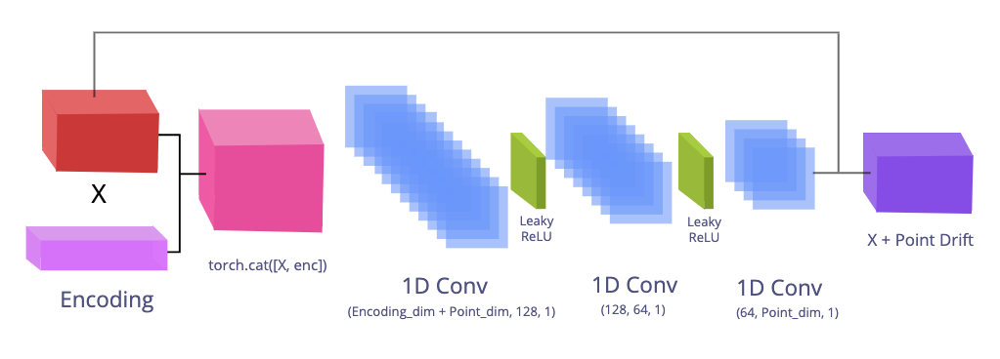
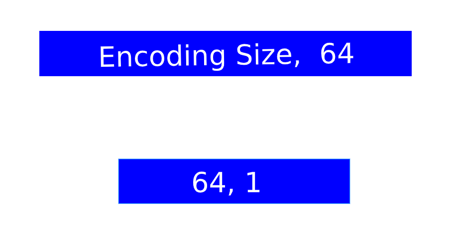
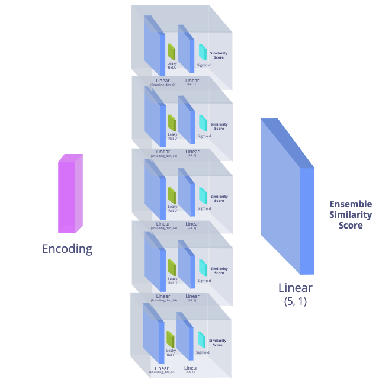
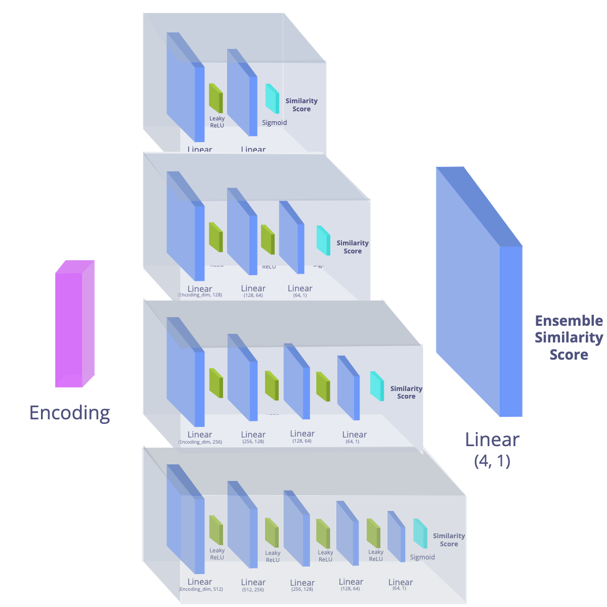

# Autodecoder Ensemble Net

An encoder-less decoder Deep Neural Network for 3D Shape Descriptor Extraction

## Data

[PointNet DataSet](https://stanford.edu/~rqi/pointnet/)

[ModelNet DataSet](https://3dshapenets.cs.princeton.edu/)

### Downloading the Dataset

Data can be acquired from the PointNet and ModelNet websites

## Preprocessing Data

Data is converted as 3D numpy arrays and converted into 3D Tensors.

## Neural Network

### AutoDecoder Net



### Comparison Net (CompNet)

<div align='center'>
  
</div>

### Objective function

We minimize the symmetric Chamfer Loss


### Hyper Parameters used

AutoDecoder Training

-   Epochs: 10

-   Learning Rate: 0.001

-   Batch Size: 32

-   Latent Encoding space size: 256

-   ADAM Optimizer

CompNet Training

-   Epochs: 20

-   Learning Rate: 0.001

-   Batch Size: 16

-   Latent Encoding space size: 256  

-   ADAM Optimizer

## Results of Similarity Classification Scores on the Test set

## Base Neural Network

For the base AutoDecoder and CompNet we get the following results:

After 157 batches and 2507 test points

    Total Accuracy: 0.8835261268448344

Metrics for the same class:

    Avg loss:  0.3021
    Precision: 0.8832
    Recall:    0.8839
    F1 Score:  0.8835

Metrics for the diff class:

    Avg loss:  0.3115
    Precision: 0.8838
    Recall:    0.8831
    F1 Score:  0.8834

## Ensemble Neural Network

### Ensemble CompNet 1

Uses 5 similar CompNets that were initialized with different weights to make them independent.

<div align='center'>
  
</div>

The AutoDecoder Ensemble Net is able to perform significantly better than the single shallow layered CompNet

After 157 batches and 2507 test points

    Total Accuracy: 0.9754

Metrics for the same class:

    Avg loss:  0.0911
    Precision: 0.9707
    Recall:    0.9804
    F1 Score:  0.9755

Metrics for the diff class:

    Avg loss:  0.1923
    Precision: 0.9802
    Recall:    0.9704
    F1 Score:  0.9753

### Ensemble CompNet 2

Uses Four CompNets of different sizes to capture the general and deeper level features



After 157 batches and 2507 test points

      Total Accuracy: 0.9615

Metrics for the same class:

      Avg loss:  0.2181
      Precision: 0.9792
      Recall:    0.9429
      F1 Score:  0.9607

Metrics for the diff class:

      Avg loss:  0.1012
      Precision: 0.9450
      Recall:    0.9800
      F1 Score:  0.9622

## Running the Autodecoder Ensemble DNN

### Set up Virtual Environment

Note: `Anaconda` can also be used for the venv

```shell
$ python -m venv venv
$ source venv/bin/activate
$ pip install -r requirements.txt
```

To start a new Jupyter Notebook kernel based on the current virtual environment and run a new Jupyter Notebook Instance:

```shell
$ python -m ipykernel install --user --name ENV_NAME --display-name "ENV_DISPLAY_NAME"
$ jupyter notebook
```

All information to run the ensemble neural network can be found in the `autodecoder_ensemble_net`.

The `geotnf` package and `LoaderFish.py` files are based on implementations from PR-Net `(Wang et al. 2019)`

## Acknowledgements

-   Non-Rigid Point Set Registration Networks, Lingjing Wang, Jianchun Chen, Xiang Li, and Yi Fang, <https://arxiv.org/pdf/1904.01428.pdf>

-   Z. Wu, S. Song, A. Khosla, F. Yu, L. Zhang, X. Tang and J. Xiao
    3D ShapeNets: A Deep Representation for Volumetric Shapes
    Proceedings of 28th IEEE Conference on Computer Vision and Pattern Recognition (CVPR2015). <https://3dshapenets.cs.princeton.edu/paper.pdf>

-   Qi, Charles R., Hao Su, Kaichun Mo, and Leonidas J. Guibas. “PointNet: Deep Learning on Point Sets for 3D Classification and Segmentation.” ArXiv:1612.00593 [Cs], April 10, 2017. <http://arxiv.org/abs/1612.00593>.
