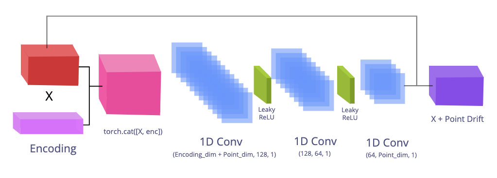
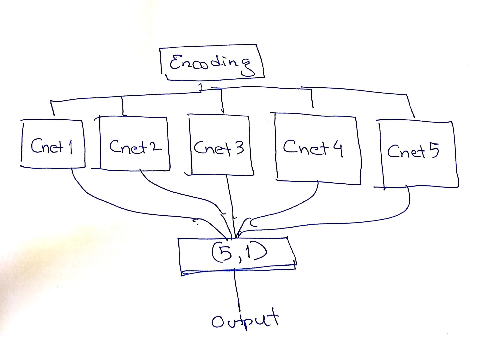
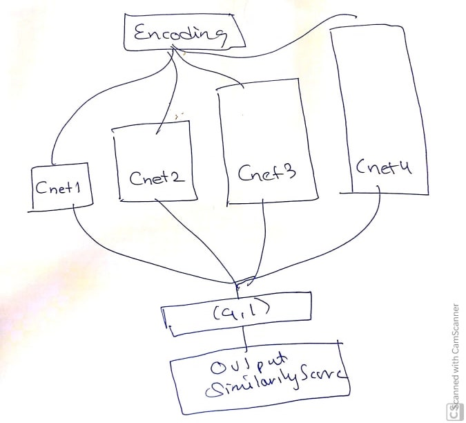

# Autodecoder Ensemble Net

An encoder-less decoder Deep Neural Network for 3D Shape Descriptor Extraction

## Data

PointNet DataSet

-   Qi, Charles R., Hao Su, Kaichun Mo, and Leonidas J. Guibas. “PointNet: Deep Learning on Point Sets for 3D Classification and Segmentation.” ArXiv:1612.00593 [Cs], April 10, 2017. <http://arxiv.org/abs/1612.00593>.

ModelNet DataSet

-   Z. Wu, S. Song, A. Khosla, F. Yu, L. Zhang, X. Tang and J. Xiao
    3D ShapeNets: A Deep Representation for Volumetric Shapes
    Proceedings of 28th IEEE Conference on Computer Vision and Pattern Recognition (CVPR2015)

### Downloading the Dataset

Data can be acquired from the PointNet and ModelNet websites

## Preprocessing Data

Data is converted as 3D numpy arrays and converted into 3D Tensors.

## Neural Network

### AutoDecoder Net



### Comparison Net


### Loss function

We use the symmetric Chamfer Loss


### Hyper Parameters used

AutoDecoder Training

-   Epochs: 10

-   Learning Rate: 0.001

-   Batch Size: 32

-   Latent Encoding space size: 256

CompNet Training

-   Epochs: 20

-   Learning Rate: 0.001

-   Batch Size: 16

-   Latent Encoding space size: 256  

## Results of Similarity Classification Scores

## Base Neural Network

For the base AutoDecoder and CompNet we get the following results:

    Total Accuracy: 0.8835261268448344
      After 157 batches and 2507 test points

    Metrics for the same class:

      Avg loss:  0.30215612478601706
      Precision: 0.8832204065364687
      Recall:    0.8839250099720782
      F1 Score:  0.8835725677830941

    Metrics for the diff class:

      Avg loss:  0.31159593186275975
      Precision: 0.8838323353293414
      Recall:    0.8831272437175908
      F1 Score:  0.8834796488427774

## Ensemble Neural Network

Uses 5 similar CompNets that were initialized with different weights to make them independent.



The AutoDecoder Ensemble Net is able to perform significantly better than the single shallow layered CompNet

    Total Accuracy: 0.9754686876745113
      After 157 batches and 2507 test points

    Metrics for the same class:

      Avg loss: 0.09116257365887902
      Precision: 0.9707740916271722
      Recall: 0.9804547267650578
      F1 Score: 0.975590394919627

    Metrics for the diff class:

      Avg loss: 0.1923845513326347
      Precision: 0.9802578565672845
      Recall: 0.9704826485839649
      F1 Score: 0.9753457606734817

Uses Four CompNets of different sizes to capture the general and deeper level features



    Total Accuracy: 0.9615077782209812
      After 157 batches and 2507 test points

    Metrics for the same class:

      Avg loss: 0.21810709794235836
      Precision: 0.9792874896437448
      Recall: 0.9429597128041484
      F1 Score: 0.9607803292013818

    Metrics for the diff class:

      Avg loss: 0.10121579959419123
      Precision: 0.945
      Recall: 0.9800558436378142
      F1 Score: 0.9622087331114156

## Running the Autodecoder Ensemble DNN

### Set up Virtual Environment

Note: `Anaconda` can also be used for the venv

```shell
$ python -m venv venv
$ source venv/bin/activate
$ pip install -r requirements.txt
```

To start a new Jupyter Notebook kernel based on the current virtual environment and run a new Jupyter Notebook Instance:

```shell
$ python -m ipykernel install --user --name ENV_NAME --display-name "ENV_DISPLAY_NAME"
$ jupyter notebook
```

All information to run the ensemble neural network can be found in the `autodecoder_ensemble_net`.

The `geotnf` package and `LoaderFish.py` files are based on implementations from PR-Net (Wang et al. 2019)

## Acknowledgements

-   Non-Rigid Point Set Registration Networks, Lingjing Wang, Jianchun Chen, Xiang Li, and Yi Fang, <https://arxiv.org/pdf/1904.01428.pdf>
