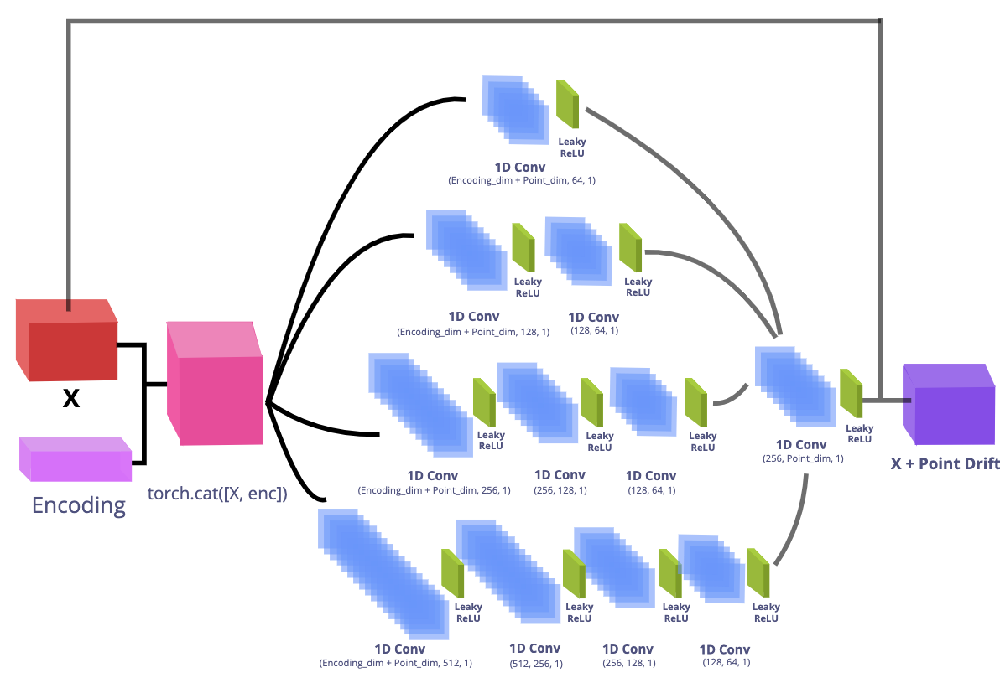

# Ensemble AutoDecoder CompNets for 3D Point Cloud Pair Encoding and Classification

Since the inception of LeNet5, Yan LeCun’s first Convolutional Neural Network for handwritten digit-recognition in 1994, Neural Networks have come a long way in classifying 2D images and extracting their features. However, since we live in a 3D world, it is natural to ask if we can extract the features of 3D shapes and classify them. This turns out to be rather difficult given the exponential increase in complexity with the added third dimension. To perform this classification efficiently, we propose an ensembled encoderless-decoder and classifier neural network to learn the latent encoding vectors for point-cloud pair transformations. This ensemble extracts the feature descriptors of the transformations without a parametric encoder or a lossy 2D projection. We also empirically demonstrate the effectiveness of our ensemble model through a benchmark comparison on a 3D point cloud classification task for the PointNet and ModelNet dataset. Finally, we discuss the applicability of our 3D shape descriptor learners and classifiers as vital preprocessing techniques for eventual 3D object classification, segmentation, and database retrieval tasks.

<div align='center'>

**Ensemble AutoDecoder Point Drift Visualization**


</div>

## Data

For training and testing our model, we use the PointNet and the ModelNet data.

<div align='center'>

  **[PointNet7](https://stanford.edu/~rqi/pointnet/)**

  
</div>

<br>
<br>

| <div align='center'>[ModelNet10](https://3dshapenets.cs.princeton.edu/) | [ModelNet40](https://3dshapenets.cs.princeton.edu/)</div> |
| :---------------------------------------------------------------------: | :-------------------------------------------------------: |
|                                                |                                  |

</div>

### Downloading the Dataset

Data can be acquired from the [PointNet](https://stanford.edu/~rqi/pointnet/) and [ModelNet](https://3dshapenets.cs.princeton.edu/)  websites.

## Preprocessing Data

We convert all 3D image data to a `.npy` 3D point cloud format. See [kaolin](https://github.com/NVIDIAGameWorks/kaolin) for conversion from ModelNet `.off` files to `.npy` files.

## Neural Network

### Single AutoDecoder


### Single CompNet (Comparison Net)

<div align='center'>
  
</div>

## Ensemble Neural Network

### Ensemble AutoDecoder

Uses four AutoDecoder Nets of different sizes to capture the shallow and deeper level features from the original point cloud that will be used for learning the latent transformation encoding between the point cloud pairs.

<div align='center'>
  
</div>

### Ensemble CompNet 1

Uses 5 similar CompNets that were initialized with different weights to make them independent.

<div align='center'>
  
</div>

The AutoDecoder Ensemble Net is able to perform significantly better than the single shallow layered CompNet

### Ensemble CompNet 2

Uses Four CompNets of different sizes to capture the general and deeper level features

<div align='center'>
  
</div>

## Methodology

After converting all 3D data into `.npy` point clouds, we create `DataLoaders` that feeds batches of Point Cloud Pairs of the same and different classes to the AutoDecoder for training.

We first create an embedding or encoding layer that will represent the latent transformation encoding vectors. between point-cloud pairs of the same and different class.

Given the embedding vector and a point-cloud, the AutoDecoder receives two more sample point-clouds, one of the same class and one of a different class.

We train the AutoDecoder's layer weights by learning the geometric transformation from the source point-cloud to the target point-cloud that might be of the same or different class. This learning is done iteratively with the ADAM optimizer where the goal is to minimize the chamfer loss between the source and target point clouds.

<div align='center'>
  
</div>

This information about the geometric transformation is stored in the embedding or the latent vector that is returned after the training process is done.

<div align='center'>
  
</div>

The latent vector that is generated by the AutoDecoder can be supplied to a classifier that can learn whether latent encoding represents point-cloud transformations between the same class or a different class. This information on class transformation can then be used for the classification of the 3D object.

Latent vectors that represent transformations between point-clouds of the same class give a higher similarity score and vice-versa for point-clouds of different classes.

<div align='center'>
  
</div>

### Objective function

We minimize the symmetric chamfer loss between point cloud pairs of the same class and different class to get the representative latent encoding transformation vector.

The Chamfer loss is easily differentiable for back-propagation and is robust to outliers in the point cloud.


### Neural Network Hyper Parameters

One of the main hyper-parameters, the encoding size for the latent vector is set to `256`.

All other Neural Network Parameters are reported in the supplementary material.

### System used for Training and Testing

    -   CPU: Intel(R) Core(TM) i9-9900K CPU @ 3.60GHz
    -   Architecture: 64 Bit
    -   RAM: 62 Gib System Memory
    -   Graphics: 7979 MiB GeForce RTX 2080

# PointNet Data Results

## PointNet7

### Results of Similarity Classification Task on PointNet7

<div align='center'>
  
</div>

<br>

**Note: The accuracies have an error of 1 percentage points between different runs**

### ROC Curves from the Similarity Classification on PointNet7

| Single CompNet  |     Ensemble CompNet     |
| :----------------------------------------------------------------: | :---------------------------------------------------------------------------: |
|   **Logistic Regr**   |        **Naive Bayes**        |
|  **Decision Trees**   | **Random Forest Classifier**  |

**Figure 1: ROC Curves for the different models on the Classification PointNet7 task**

### Accuracy and Training time comparisons on PointNet7

<div align='center'>
  
</div>

<br>

**Note: The accuracies have an error of 1 percentage points between different runs**

### Ensemble AutoDecoder used with Single and Ensemble CompNets on PointNet7

|                                   |                Single CompNet               |                Ensemble CompNet                |
| :-------------------------------: | :-----------------------------------------: | :--------------------------------------------: |
|  **Single AutoDecoder** `5m 24s`  | `25.4s`  | `1m 12.2s`  |
| **Ensemble AutoDecoder** `8m 24s` | `25.2s`  |   `14.4s`   |

### Performance Metrics from Single and Ensemble AutoDecoders on PointNet7

<div align='center'>
  
</div>

<br>

**Note: The accuracies have an error of 1 percentage points between different runs**

## Full PointNet

### ROC Curves from the Similarity Classification

**Note: Results for the Neural Network Models models only**

|            Single CompNet (Full PointNet)           |            Ensemble CompNet (Full PointNet)           |
| :-------------------------------------------------: | :---------------------------------------------------: |
|  |  |

AutoDecoder Training time was `11m 45s`; Single CompNet and Ensemble CompNet training times were at `26.6s` and `13.1s` respectively.

# ModelNet Data Results

## ModelNet10

### Performance Metrics from Single and Ensemble AutoDecoders on ModelNet10

<div align='center'>
  
</div>

<br>

**Note: The accuracies have an error of 2 percentage points between different runs**

### ROC Curves from the Similarity Classification on ModelNet10

|                                   |                Single CompNet                |               Ensemble CompNet               |
| :-------------------------------: | :------------------------------------------: | :------------------------------------------: |
|  **Single AutoDecoder** `5m 59s`  | `10.0s`  | `27.7s`  |
| **Ensemble AutoDecoder** `8m 41s` | `9.83s`  | `27.2s`  |

## ModelNet40

### Performance Metrics from Single and Ensemble AutoDecoders on ModelNet40

<div align='center'>
  
</div>

<br>

**Note:**

-   The accuracies have an error of 3 percentage points between different runs
-   The Dataset contains samples from only 33 classes for training and testing as the conversion module (`kaolin`) we were using could not resolve some of the `.off` files in the ModelNet40 dataset. The used classes are mentioned in the supplementary material.

### ROC Curves from the Similarity Classification on ModelNet40

|                                    |                Single CompNet                |                Ensemble CompNet               |
| :--------------------------------: | :------------------------------------------: | :-------------------------------------------: |
|  **Single AutoDecoder** `11m 39s`  | `47.1s`  |  `2m 9s`  |
| **Ensemble AutoDecoder** `16m 51s` | `47.8s`  | `2m 12s`  |

## Conclusion

In the general, no matter whether the AutoDecoder has a single Neural Network or an ensemble Neural Network, the ensemble Comparison Nets (CompNets) always outperform all the Single CompNets in classification tasks for the same and different class. In general there is an average improvement of 10% in accuracy when switching to an ensemble classifier network for all of the different datasets that were used.

We also show that our neural network classification models (Single and Ensemble CompNets) always outperform all other classical supervised machine learning models in accuracy, f1-scores and Receiving Operator Characteristic Area Under Curve (ROC-AUC) for the 3D object classification task (See Table 1).

The training times for the different datasets also show that our method computes latent encodings and does the classifications very quickly given our training system statistics.

However, the efficacy of an ensemble AutoDecoder network was not observed for all datasets, especially for `PointNet7`, where the total accuracy and related metrics actually decreased.

One of the reasons for this reduced accuracy for the Ensemble AutoDecoder Net could be the highly imbalanced nature of training set for the `PointNet7` dataset.

<div align='center'>
  
</div>

## Running the AutoDecoder CompNet Ensemble

### Set up Virtual Environment

Note: `Anaconda` can also be used for the venv

```shell
$ python -m venv venv
$ source venv/bin/activate
$ pip install -r requirements.txt
```

To start a new Jupyter Notebook kernel based on the current virtual environment and run a new Jupyter Notebook Instance:

```shell
$ python -m ipykernel install --user --name ENV_NAME --display-name "ENV_DISPLAY_NAME"
$ jupyter notebook
```

All information to run the ensemble neural network can be found in the `autodecoder_ensemble_net`.

The `geotnf` package and `LoaderFish.py` files are based on implementations from PR-Net `(Wang et al. 2019)`

## References

-   Non-Rigid Point Set Registration Networks, Lingjing Wang, Jianchun Chen, Xiang Li, and Yi Fang, <https://arxiv.org/pdf/1904.01428.pdf>

-   X. Chenhao, "EPDNet: Encoder-less 3D Shape Descriptor Extraction", 2020, NYUAD Capstone Seminar

-   Z. Wu, S. Song, A. Khosla, F. Yu, L. Zhang, X. Tang and J. Xiao 3D ShapeNets: A Deep Representation for Volumetric Shapes Proceedings of 28th IEEE Conference on Computer Vision and Pattern Recognition (CVPR2015). <https://3dshapenets.cs.princeton.edu/paper.pdf>

-   Park, Jeong Joon et al. “DeepSDF: Learning Continuous Signed Distance Functions for Shape Representation.” 2019 IEEE/CVF Conference on Computer Vision and Pattern Recognition (CVPR) (2019): 165-174.

-   Bojanowski, Piotr et al. “Optimizing the Latent Space of Generative Networks.” ICML (2018).

-   Wang, Lingjing et al. “Non-Rigid Point Set Registration Networks.” ArXiv abs/1904.01428 (2019): n. Pag.

-   Qi, Charles Ruizhongtai et al. “PointNet: Deep Learning on Point Sets for 3D Classification and Segmentation.” 2017 IEEE Conference on Computer Vision and Pattern Recognition (CVPR) (2017): 77-85.

-   Rostami, R., Bashiri, F.S., Rostami, B. and Yu, Z. (2019), A Survey on Data‐Driven 3D Shape Descriptors. Computer Graphics Forum, 38: 356-393. doi:10.1111/cgf.13536

-   E. TaSci and A. Ugur, "Image classification using ensemble algorithms with deep learning and hand-crafted features," 2018 26th Signal Processing and Communications Applications Conference (SIU), Izmir, 2018, pp. 1-4, doi: 10.1109/SIU.2018.8404179.

-   Wolpert, David H. “Stacked Generalization.” Neural Networks 5, no. 2 (January 1992): 241–59. <https://doi.org/10.1016/S0893-6080(05)80023-1>.

-   Xie, Jingjing et al. “Horizontal and Vertical Ensemble with Deep Representation for Classification.” ArXiv abs/1306.2759 (2013): n. pag.

-   Nahas, Mohammed & Hussein, Mahmoud & Keshk, Arabi. (2019). Artificial Neural Network as Ensemble Technique Fuser for Improving Classification Accuracy. 174-179. 10.1109/ICICIS46948.2019.9014791.
