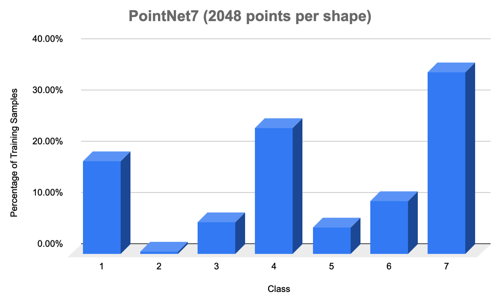
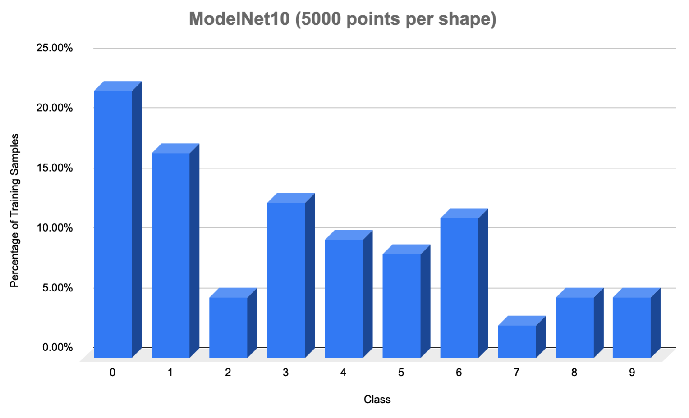
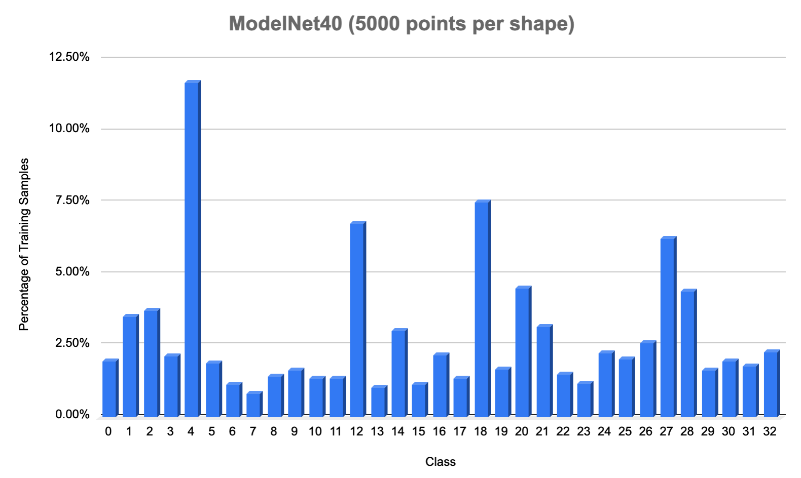
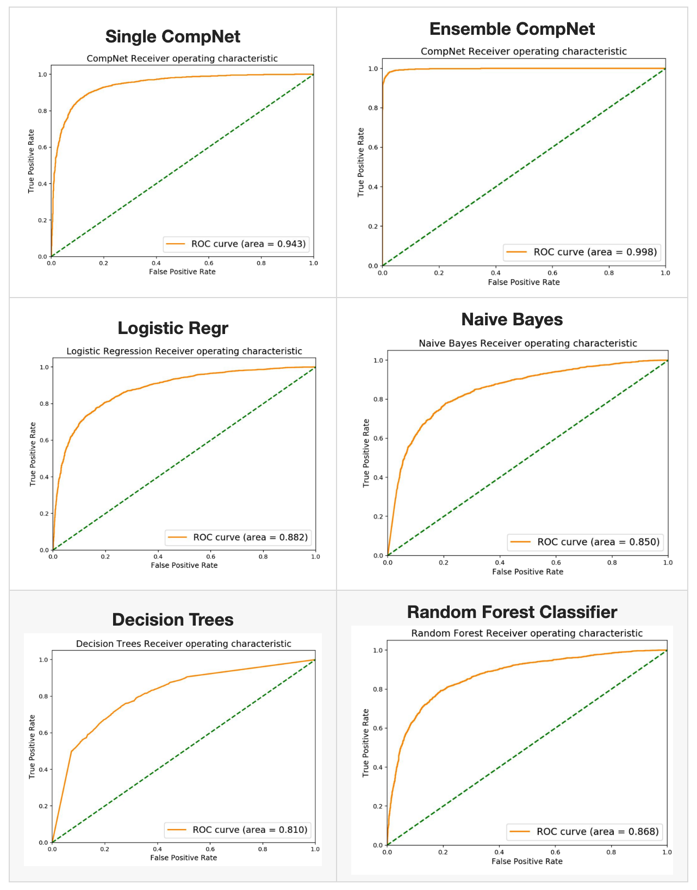

# Supplementary information

## Classes used in ModelNet40

    airplane, bed, bench, bookshelf, bottle, bowl, car,
    chair, cone, cup, curtain, door, flower_pot, glass_box,
    guitar, keyboard, lamp, laptop, mantel, person, piano,
    plant, radio, range_hood, sink, stairs, stool, tent,
    toilet, tv_stand, vase, wardrobe, xbox

## Train set class data distribution

## System used for Training

**NVIDIA-GPU Statistics**

    +-----------------------------------------------------------------------------+
    | NVIDIA-SMI 430.40       Driver Version: 430.40       CUDA Version: 10.1     |
    |-------------------------------+----------------------+----------------------+
    | GPU  Name        Persistence-M| Bus-Id        Disp.A | Volatile Uncorr. ECC |
    | Fan  Temp  Perf  Pwr:Usage/Cap|         Memory-Usage | GPU-Util  Compute M. |
    |===============================+======================+======================|
    |   0  GeForce RTX 2080    Off  | 00000000:01:00.0  On |                  N/A |
    | N/A   40C    P8     9W /  N/A |    185MiB /  7979MiB |      0%      Default |
    +-------------------------------+----------------------+----------------------+

**Computer Statistics:**

      Width: 64 bits
      Core
         Description: Motherboard
         Memory
            description: System memory
            size: 62GiB
         CPU
            product: Intel(R) Core(TM) i9-9900K CPU @ 3.60GHz
            vendor: Intel Corp.
            size: 3086MHz
            capacity: 5GHz
            width: 64 bits
         PCI:0
            description: PCI bridge
            product: Xeon E3-1200 v5/E3-1500 v5/6th Gen Core Processor PCIe Controller (x16)
            vendor: Intel Corporation
            version: 0d
            width: 32 bits
            clock: 33MHz
            configuration: driver=pcieport
          DISPLAY
              description: VGA compatible controller
              product: NVIDIA Corporation
              version: a1
              width: 64 bits
              clock: 33MHz
              configuration: driver=nvidia latency=0

## Neural Network Training Hyper-parameters

`PyTorch` and `Numpy` SEED Value used as `17*19`

### Neural Network Hyper Parameters used

AutoDecoder Training

    -   Epochs: 4
    -   Learning Rate: 0.001
    -   Batch Size: 32
    -   Latent Encoding space size: 256
    -   ADAM Optimizer

CompNet Training

    -   Epochs: 20
    -   Learning Rate: 0.001
    -   Batch Size: 16
    -   Latent Encoding space size: 256  
    -   ADAM Optimizer

CompNet Training (Only for ModelNet40)

    -   Epochs: 50
    -   Learning Rate: 0.001
    -   Batch Size: 16
    -   Latent Encoding space size: 256  
    -   ADAM Optimizer

Encoding Pair Training

    -   Number of iterations: 15
    -   Learning Rate: 0.05
    -   Batch Size: 16
    -   Latent Encoding space size: 256  
    -   ADAM Optimizer

## Ensemble AutoDecoder CompNet ROC-AUC Results

### ROC Curves from the benchmarked classification models

### ROC Curves from the Similarity Classification on PointNet7

### ROC Curves from the Similarity Classification on PointNet Full

### ROC Curves from the Similarity Classification on ModelNet10

### ROC Curves from the Similarity Classification on ModelNet40

